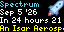

<!-- community-maintenance:start -->
## Community maintenance

This community-maintained version includes updates to Starlark source, previews, compared with the shared Tronbyt ancestor in the September 21, 2026 audit. Original author and license notices remain in the source, manifest, and any original documentation below. Maintenance credit does not replace original authorship.

Original authors and other contributors can follow [Updating your app](../../docs/UPDATING_YOUR_APP.md) and [CONTRIBUTING.md](../../CONTRIBUTING.md). Preserve app IDs, settings compatibility, original credits, and applicable licenses. Describe changes and actual test results in your pull request.

See [known compatibility differences](../../docs/COMPATIBILITY.md) and [maintenance history](../../docs/MAINTENANCE.md). These notes do not certify live integration or compatibility with every runtime. Earlier setup instructions below may describe the upstream version.
<!-- community-maintenance:end -->

# Launch Countdown Applet for Tidbyt

Displays the next rocketlaunch in the world based on the data provided by rocketlaunch.live.

Allows you to filter by County, and provider. 
Also allows you to only display launches within X hours.
Allows you to hide this app if there is nothing to display.

## Timezone settings (September 2026)

Timezone is now a searchable IANA timezone setting. Leave it blank to follow the display timezone. Existing installations retain their previous effective timezone through the reviewed Cloud migration.

Downstream change, original authorship retained. Requires the Niblet runtime with timezone Text metadata. All changed schemas were evaluated with networking denied. Migration and rendering evidence is recorded in the timezone release audit; schema checks alone do not certify live provider behavior.
